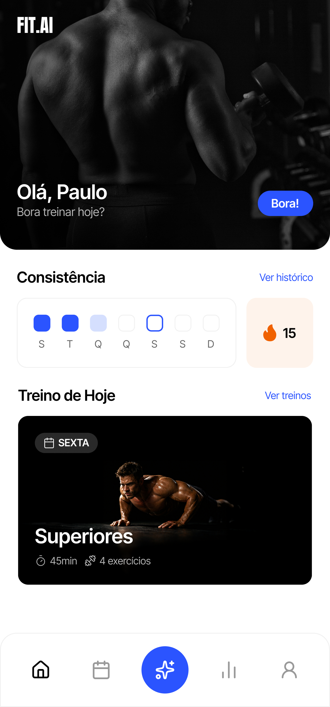

# 💪 FIT.AI — Front-end

Front-end do **FIT.AI**, um aplicativo de fitness/treino que ajuda o usuário a montar planos de treino, acompanhar sua rotina no dia a dia e manter a consistência. O grande diferencial do produto é o **Coach AI**, um assistente de inteligência artificial que conversa com o usuário para montar planos de treino e responder dúvidas.

A aplicação é construída com **Next.js 16 (App Router)** e foi pensada para uma experiência **mobile-first** (todas as telas usam um container com largura máxima de `max-w-md`). Toda a interface está em **português do Brasil (pt-BR)**.

> **Nota:** este repositório é o front-end. Ele depende de uma API separada (veja a seção [🔌 Back-end](#-back-end)).

---

<!-- ## 🖼️ Preview

- **Aplicação publicada:** não foi encontrado nenhum link de deploy (arquivos como `vercel.json` ou variáveis de deploy) no código.
- **Imagens/GIFs:** o projeto já possui alguns assets de UI em [public/](public/) (banners e logo), mas **não** há capturas de tela das telas montadas. Recomenda-se adicionar screenshots ou GIFs das principais telas (Login, Home, Treino do Dia, Estatísticas, Perfil e Coach AI) e referenciá-los aqui, por exemplo:

  ```md
  
  
  ``` -->

## ✨ Funcionalidades

Funcionalidades identificadas diretamente no código:

- **Login com Google** — autenticação social via BetterAuth ([src/app/auth/page.tsx](src/app/auth/page.tsx)). Usuários já logados são redirecionados para a Home.
- **Fluxo de onboarding** — usuários que ainda não possuem dados de treino ou um plano ativo são redirecionados para `/onboarding`, onde conversam com o Coach AI para começar ([src/app/onboarding/page.tsx](src/app/onboarding/page.tsx), [src/app/_lib/require-onboarding.ts](src/app/_lib/require-onboarding.ts)).
- **Home** — saudação personalizada, cartão de **consistência** com contador de _streak_ e exibição do **treino de hoje** (ou uma mensagem de descanso) ([src/app/page.tsx](src/app/page.tsx)).
- **Plano de treino** — lista os dias da semana do plano, ordenados, diferenciando dias de treino e dias de descanso ([src/app/workout-plans/[workoutPlanId]/page.tsx](src/app/workout-plans/%5BworkoutPlanId%5D/page.tsx)).
- **Treino do dia** — exibe os exercícios (séries, repetições e tempo de descanso), permite **iniciar** e **concluir** uma sessão de treino, além de ajuda por exercício ([src/app/workout-plans/[workoutPlanId]/days/[workoutDayId]/page.tsx](src/app/workout-plans/%5BworkoutPlanId%5D/days/%5BworkoutDayId%5D/page.tsx)).
- **Estatísticas** — mapa de calor de consistência dos últimos ~3 meses, total de treinos concluídos, taxa de conclusão, tempo total treinado e _streak_ ([src/app/stats/page.tsx](src/app/stats/page.tsx)).
- **Perfil** — dados do usuário (peso, altura, percentual de gordura e idade), avatar e **logout** ([src/app/profile/page.tsx](src/app/profile/page.tsx)).
- **Coach AI (chat com IA)** — assistente com respostas em _streaming_, disponível como overlay flutuante em qualquer tela e também no onboarding, com mensagens sugeridas (ex.: _"Monte meu plano de treino"_) ([src/components/chat/chat.tsx](src/components/chat/chat.tsx)). O estado de abertura do chat é controlado pela URL via `nuqs`.
- **Navegação inferior** — barra fixa com atalhos para Início, Agenda, Coach AI, Estatísticas e Perfil ([src/components/home/bottom-navigation.tsx](src/components/home/bottom-navigation.tsx)).
- **Proteção de rotas por sessão** — as páginas verificam a sessão diretamente (sem middleware) e redirecionam para `/auth` quando não autenticadas.

---

## 🧰 Tecnologias utilizadas

### Framework e linguagem

- **[Next.js 16](https://nextjs.org/) (App Router)** — framework React full-stack; aqui usado com Server Components, Server Actions e Route Handlers. O **React Compiler** está habilitado (`reactCompiler: true`), otimizando memoização automaticamente.
- **[React 19](https://react.dev/)** — biblioteca de UI.
- **[TypeScript 5](https://www.typescriptlang.org/)** — tipagem estática em todo o código, com _path alias_ `@/*` → `src/*`.

### Estilização e UI

- **[Tailwind CSS v4](https://tailwindcss.com/)** — CSS utilitário. A configuração é baseada em CSS (não há `tailwind.config`); o tema e os _design tokens_ vivem em [src/app/globals.css](src/app/globals.css).
- **[shadcn/ui](https://ui.shadcn.com/)** — coleção de componentes acessíveis sobre Radix UI (estilo `radix-vega`, cor base `neutral`), instalados localmente em [src/components/ui/](src/components/ui/).
- **[Radix UI](https://www.radix-ui.com/)** — primitivos de UI acessíveis.
- **[lucide-react](https://lucide.dev/)** — biblioteca de ícones.
- **[tw-animate-css](https://www.npmjs.com/package/tw-animate-css)** — utilitários de animação para Tailwind.
- **[class-variance-authority](https://cva.style/), [clsx](https://github.com/lukeed/clsx) e [tailwind-merge](https://github.com/dcastil/tailwind-merge)** — composição condicional de classes (utilitário `cn()` em [src/lib/utils.ts](src/lib/utils.ts)).
- **[next-themes](https://github.com/pacocoursey/next-themes)** — suporte a temas (claro/escuro).
- **[sonner](https://sonner.emilkowal.ski/)** — notificações _toast_.

### Formulários e validação

- **[React Hook Form](https://react-hook-form.com/)** — gerenciamento de formulários.
- **[Zod](https://zod.dev/)** — validação de _schemas_ (integrado ao RHF via `@hookform/resolvers`).

### Autenticação

- **[BetterAuth](https://www.better-auth.com/)** — autenticação; o cliente (`better-auth/react`) é configurado em [src/app/_lib/auth-client.ts](src/app/_lib/auth-client.ts) e aponta para a API. Login via provedor social **Google**.

### Data fetching e integração com a API

- **[Orval](https://orval.dev/)** — gera automaticamente funções e tipos TypeScript a partir do OpenAPI/Swagger da API ([orval.config.ts](orval.config.ts)). O cliente gerado (`client: "fetch"`) fica em [src/app/_lib/api/fetch-generated/](src/app/_lib/api/fetch-generated/) e usa um _fetch_ customizado ([src/app/_lib/fetch.ts](src/app/_lib/fetch.ts)) que injeta cookies para autenticação.

  > O arquivo de configuração também prevê a geração de _hooks_ do **TanStack Query** para uso em Client Components (bloco `rc` em `orval.config.ts`), mas essa saída está atualmente comentada — hoje o data fetching acontece majoritariamente em Server Components.

### Inteligência Artificial

- **[AI SDK](https://sdk.vercel.ai/) (`ai` + `@ai-sdk/react`)** — hook `useChat` para o chat do Coach AI, com respostas em _streaming_.
- **[streamdown](https://www.npmjs.com/package/streamdown)** — renderização de Markdown em _streaming_ nas respostas da IA.
- O front-end expõe uma rota `POST /ai` ([src/app/ai/route.ts](src/app/ai/route.ts)) que faz _proxy_ das mensagens para a API, repassando os cookies de sessão.

### Utilitários

- **[dayjs](https://day.js.org/)** — manipulação e formatação de datas (padrão do projeto).
- **[nuqs](https://nuqs.47ng.com/)** — estado sincronizado com a _query string_ da URL (usado para abrir/fechar o chat).
- **[dotenv](https://github.com/motdotla/dotenv)** — carregamento de variáveis de ambiente (usado no `orval.config.ts`).

### Ferramentas de build e qualidade

- **[pnpm](https://pnpm.io/)** — gerenciador de pacotes.
- **[Biome](https://biomejs.dev/)** — _linter_ + _formatter_ + organização de imports (substitui ESLint/Prettier).
- **[babel-plugin-react-compiler](https://react.dev/learn/react-compiler)** — habilita o React Compiler.

> **Gerenciamento de estado:** o projeto **não** utiliza Redux nem Context API para estado global. O estado é local aos componentes; dados do servidor vêm de Server Components e o estado de UI compartilhável (chat) é mantido na URL via `nuqs`.

---

## 🏗️ Arquitetura do projeto

O projeto segue a arquitetura do **App Router** do Next.js, priorizando **Server Components** para a busca de dados.

### Organização das pastas

- **`src/app/`** — rotas da aplicação (cada pasta é uma rota). Helpers **não-componentes** locais de rota ficam em pastas prefixadas com `_` (ex.: `_lib/`), que o Next.js ignora como rota.
  - **`src/app/_lib/`** — camada de infraestrutura compartilhada: cliente de autenticação, _fetch_ customizado, cliente de API gerado pelo Orval, helpers de onboarding e estado do chat.
- **`src/components/`** — **todos** os componentes React. Primitivos do shadcn/ui em `ui/` e componentes de cada _feature_ agrupados na sua própria subpasta (ex.: `home/`, `stats/`, `chat/`, `workout-day/`).
- **`src/lib/`** — utilitários genéricos (ex.: `cn()`).

### Principais módulos

- **Autenticação** — sessão verificada na própria página (sem middleware), com redirecionamentos entre `/auth` e as páginas protegidas.
- **Camada de API** — funções tipadas geradas pelo Orval + `customFetch` que injeta os cookies e monta a URL com base em `NEXT_PUBLIC_API_URL`.
- **Coach AI** — chat isolado no módulo `chat/`, com overlay controlado por URL e rota de _proxy_ para a API.
- **Domínio de treino** — Home, Plano de Treino, Treino do Dia, Estatísticas e Perfil.

### Fluxo da aplicação

1. O usuário acessa a aplicação. Se não estiver autenticado, é redirecionado para **`/auth`** (login com Google).
2. Após o login, o helper `redirectIfNotOnboarded()` verifica se o usuário possui **dados de treino** e um **plano ativo**. Se não tiver, é enviado para **`/onboarding`**.
3. No onboarding, o usuário conversa com o **Coach AI** para gerar seu plano.
4. Com plano ativo, o usuário navega pela **Home**, acessa o **Treino do Dia** (iniciando/concluindo sessões via **Server Actions**), acompanha **Estatísticas** e gerencia o **Perfil**.
5. Em qualquer tela, o **Coach AI** pode ser aberto como overlay flutuante.

---

## 🚀 Como executar o projeto

### Pré-requisitos

- **Node.js** 20+ (recomendado, compatível com Next.js 16).
- **[pnpm](https://pnpm.io/)** instalado (`npm install -g pnpm`).
- A **API do FIT.AI** rodando e acessível (veja a seção [🔌 Back-end](#-back-end)).

### Instalação

```bash
# clone o repositório
git clone <url-deste-repositorio>
cd front-end

# instale as dependências
pnpm install
```

### Configuração do `.env`

Crie um arquivo `.env` na raiz do projeto com as variáveis abaixo (valores de exemplo para ambiente local):

```env
# URL base da API do FIT.AI (back-end)
NEXT_PUBLIC_API_URL=http://localhost:8081

# URL base desta aplicação (usada no callback do login social)
NEXT_PUBLIC_BASE_URL=http://localhost:3000
```

> `NEXT_PUBLIC_API_URL` também é utilizada pelo Orval para ler o Swagger da API (`${NEXT_PUBLIC_API_URL}/swagger.json`) ao gerar o cliente.

### Gerar o cliente da API (Orval)

O cliente de API gerado é necessário para o data fetching. Com a API no ar, gere os arquivos:

```bash
npx orval
```

### Ambiente de desenvolvimento

```bash
pnpm dev
```

A aplicação ficará disponível em [http://localhost:3000](http://localhost:3000).

### Produção

```bash
# build de produção
pnpm build

# iniciar o servidor de produção
pnpm start
```

---

## 🔌 Back-end

O front-end consome uma **API REST própria do FIT.AI**, responsável por autenticação, planos e dias de treino, sessões de treino, estatísticas, dados do usuário e o endpoint de IA (`/ai`) do Coach AI. A documentação dessa API é exposta via **OpenAPI/Swagger** (`/swagger.json`), a partir da qual o **Orval** gera automaticamente as funções e os tipos consumidos aqui.

- **Repositório do Back-end:** [https://github.com/Viniciusrbr/fit-ai-api](https://github.com/Viniciusrbr/fit-ai-api)

### Endpoints consumidos (identificados no cliente gerado)

| Método | Rota | Descrição |
| --- | --- | --- |
| `GET` | `/home/:date` | Dados da Home (treino do dia, consistência, _streak_) |
| `GET` | `/workout-plans/` | Listar planos de treino |
| `POST` | `/workout-plans/` | Criar plano de treino |
| `GET` | `/workout-plans/:id` | Obter um plano de treino |
| `GET` | `/workout-plans/:planId/days/:dayId` | Obter um dia de treino (exercícios + sessões) |
| `POST` | `/workout-plans/:planId/days/:dayId/sessions` | Iniciar uma sessão de treino |
| `PATCH` | `/workout-plans/:planId/days/:dayId/sessions/:id` | Atualizar/concluir uma sessão |
| `GET` | `/stats/` | Estatísticas do usuário em um período |
| `GET` | `/me/` | Dados de treino do usuário |
| `POST` | `/ai` | Chat com o Coach AI |

### Como executar a API localmente

O passo a passo definitivo está no repositório do back-end. De forma resumida, você deve subir a API na porta configurada e apontar o front-end para ela via `NEXT_PUBLIC_API_URL` (por padrão, `http://localhost:8081`).

> Os detalhes exatos de instalação, banco de dados e variáveis de ambiente da API **não** puderam ser determinados a partir deste repositório de front-end — consulte o [README do back-end](https://github.com/Viniciusrbr/fit-ai-api).

### Variáveis de ambiente necessárias para conectar o front-end

| Variável | Descrição | Exemplo |
| --- | --- | --- |
| `NEXT_PUBLIC_API_URL` | URL base da API do FIT.AI | `http://localhost:8081` |
| `NEXT_PUBLIC_BASE_URL` | URL base do front-end (callback do login social) | `http://localhost:3000` |

---

## 📁 Estrutura de pastas

Árvore simplificada das principais pastas e arquivos:

```txt
front-end/
├── public/                         # assets estáticos (logo, banners, ícones)
├── src/
│   ├── app/                        # rotas (App Router)
│   │   ├── _lib/                   # infra local: auth, fetch, api gerada, helpers
│   │   │   ├── api/
│   │   │   │   └── fetch-generated/  # cliente da API gerado pelo Orval
│   │   │   ├── auth-client.ts        # cliente BetterAuth
│   │   │   ├── fetch.ts              # fetch customizado (Orval mutator)
│   │   │   ├── require-onboarding.ts # guarda de onboarding
│   │   │   ├── chat-url-state.ts     # estado do chat via URL (nuqs)
│   │   │   └── week-days.ts          # ordenação dos dias da semana
│   │   ├── auth/                   # tela de login
│   │   ├── onboarding/             # onboarding via Coach AI
│   │   ├── stats/                  # estatísticas
│   │   ├── profile/                # perfil
│   │   ├── workout-plans/          # planos e dias de treino (rotas dinâmicas)
│   │   ├── ai/route.ts             # proxy do chat de IA
│   │   ├── layout.tsx              # layout raiz (fontes, providers, chat widget)
│   │   ├── page.tsx                # Home
│   │   └── globals.css             # tema e design tokens (Tailwind v4)
│   ├── components/                 # todos os componentes React
│   │   ├── ui/                     # primitivos shadcn/ui
│   │   ├── home/  stats/  profile/ # componentes por feature
│   │   ├── workout-plan/  workout-day/
│   │   └── chat/                   # Coach AI (widget, overlay, chat)
│   └── lib/
│       └── utils.ts                # utilitário cn()
├── tasks/                          # especificações das telas (docs de trabalho)
├── orval.config.ts                 # configuração do Orval
├── next.config.ts                  # configuração do Next.js
├── biome.json                      # configuração do Biome
├── components.json                 # configuração do shadcn/ui
└── tsconfig.json                   # configuração do TypeScript
```

---

## 📜 Scripts disponíveis

Definidos em [package.json](package.json):

| Script | Comando | Descrição |
| --- | --- | --- |
| `dev` | `pnpm dev` | Inicia o servidor de desenvolvimento (Next.js) em `localhost:3000`. |
| `build` | `pnpm build` | Gera o _build_ de produção. |
| `start` | `pnpm start` | Sobe o servidor de produção (requer `build` prévio). |
| `lint` | `pnpm lint` | Roda o Biome (`biome check`) — lint + organização de imports. |
| `format` | `pnpm format` | Formata o código com o Biome, escrevendo as alterações. |

Comando auxiliar (não é um script do `package.json`, mas parte do fluxo):

| Comando | Descrição |
| --- | --- |
| `npx orval` | Regenera o cliente da API (funções, tipos) a partir do Swagger. |

> Não há _test runner_ configurado neste projeto.

---

## ✅ Boas práticas utilizadas

- **Componentização** — cada componente em seu próprio arquivo, agrupado por _feature_ em `src/components/`, com primitivos de UI reutilizáveis em `ui/`.
- **Hooks** — uso de hooks do React e de bibliotecas (`useChat`, `useSession`, `useChatUrlState`, hooks do React Hook Form).
- **Context API / Redux** — **não utilizados**. Prioriza-se estado no servidor (Server Components) e estado de UI compartilhável na URL (`nuqs`), evitando complexidade desnecessária de estado global.
- **Clean Code / SOLID / DRY** — funções e componentes pequenos e reutilizáveis (ex.: `cn()`, `WorkoutDayCard`, `StatCard`), helpers isolados (`require-onboarding`, `week-days`) e ausência de comentários ruidosos no código.
- **Responsividade** — layout **mobile-first** com container `max-w-md`, unidades relativas e utilitários responsivos do Tailwind.
- **Acessibilidade** — componentes shadcn/ui sobre Radix UI, uso de `aria-label` na navegação/botões de ícone e HTML semântico (`<main>`, `<nav>`, `<header>`, `<section>`).
- **Tipagem** — TypeScript em `strict` mode e tipos gerados automaticamente pelo Orval a partir do contrato OpenAPI, garantindo consistência entre front-end e API.
- **Organização do código** — _path alias_ `@/*`, separação clara entre rotas (`app/`), componentes (`components/`) e utilitários (`lib/`), além de _design tokens_ centralizados em `globals.css`.
- **Padronização** — Biome garante lint, formatação e organização de imports consistentes.
- **Segurança de sessão** — o _fetch_ customizado propaga cookies e usa `credentials: "include"`; a rota de IA faz _proxy_ preservando a sessão.

---

## 🔮 Possíveis melhorias

- **Testes automatizados** — adicionar testes unitários e de componente (ex.: Vitest + Testing Library) e testes E2E (ex.: Playwright), já que não há _test runner_ configurado.
- **Habilitar os hooks do TanStack Query** — ativar o bloco `rc` do Orval para data fetching client-side com _cache_, revalidação e uso de `initialData` a partir dos Server Components.
- **Página inicial padrão** — a rota `/` foi substituída pela Home, mas convém revisar/remover os assets _boilerplate_ do `create-next-app` em `public/` (ex.: `next.svg`, `vercel.svg`).
- **Documentação visual** — incluir screenshots/GIFs das telas e, se aplicável, um link de deploy na seção de Preview.
- **Tratamento de erros e estados de carregamento** — padronizar `loading.tsx` / `error.tsx` por rota e _skeletons_ para melhorar a percepção de performance.
- **Tema claro/escuro** — como `next-themes` já é dependência, expor um _toggle_ de tema para o usuário.
- **CI/CD** — adicionar _pipeline_ (lint + build + testes) e configuração de deploy.
- **Acessibilidade avançada** — auditoria com ferramentas dedicadas (ex.: axe) e testes de navegação por teclado.

